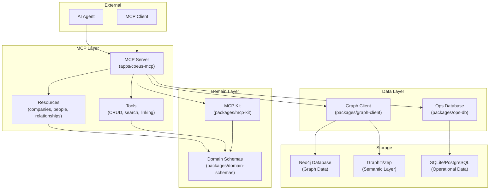
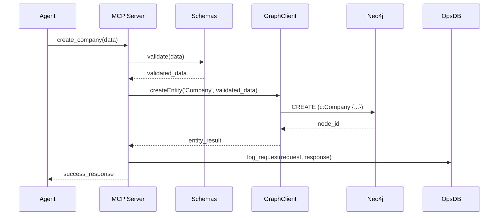
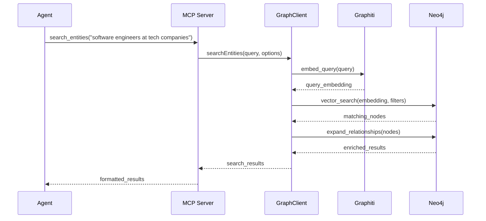
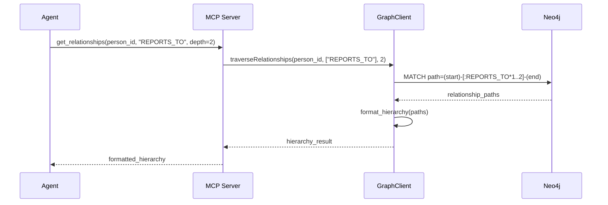
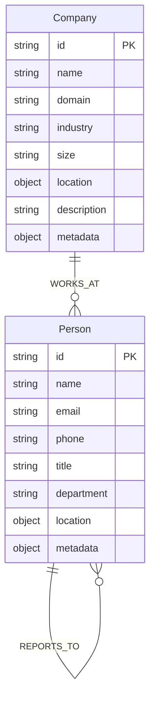
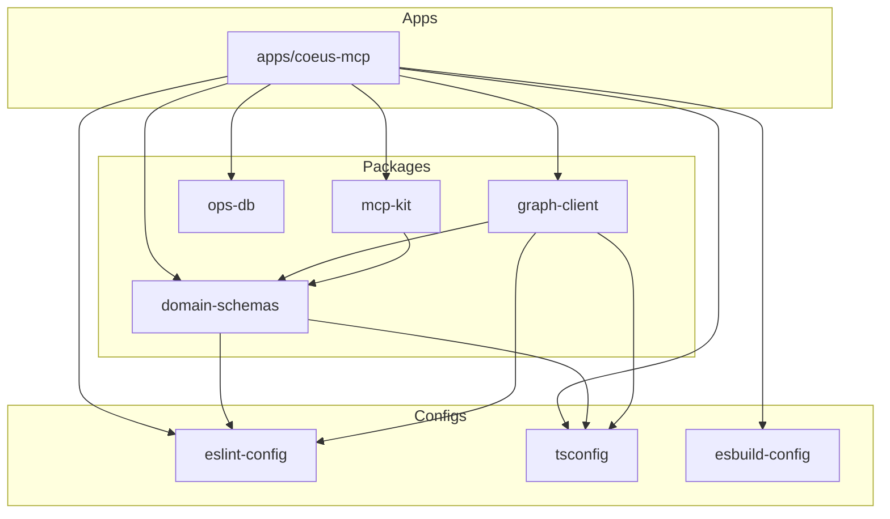

# Architecture: Coeus MCP CRM

## System Overview
Coeus follows a layered architecture with clear separation of concerns, built around a knowledge graph as the central data store. The system is designed for extensibility, testability, and maintainability while providing high-performance graph operations.



## Component Details

### MCP Server (`apps/coeus-mcp`)
**Purpose**: Single point of entry for all agent interactions
**Responsibilities**:
- MCP protocol compliance and request handling
- Request validation and error handling
- Resource and tool endpoint implementation
- Logging and monitoring
- Health checks and status reporting

**Key Files**:
- `server.ts` - Main MCP server setup and configuration
- `resources/` - Resource handlers (companies, people, relationships)
- `tools/` - Tool handlers (CRUD, search, linking operations)
- `middleware/` - Request validation, logging, error handling
- `health.ts` - Health check endpoints

### Domain Schemas (`packages/domain-schemas`)
**Purpose**: Centralized type definitions and validation
**Responsibilities**:
- Entity schema definitions (Company, Person)
- Relationship type definitions (WORKS_AT, REPORTS_TO)
- Validation rules and normalization logic
- TypeScript type exports
- Entity linking utilities

**Key Schemas**:
```typescript
// Company entity
interface Company {
  id: string;
  name: string;
  domain?: string;
  industry?: string;
  size?: CompanySize;
  location?: Location;
  description?: string;
  metadata: Record<string, unknown>;
}

// Person entity
interface Person {
  id: string;
  name: string;
  email?: string;
  phone?: string;
  title?: string;
  department?: string;
  location?: Location;
  metadata: Record<string, unknown>;
}

// Relationship types
type RelationshipType = 'WORKS_AT' | 'REPORTS_TO';

interface Relationship {
  type: RelationshipType;
  from: string;
  to: string;
  properties?: Record<string, unknown>;
  startDate?: Date;
  endDate?: Date;
}
```

### Graph Client (`packages/graph-client`)
**Purpose**: Abstraction layer for graph database operations
**Responsibilities**:
- Neo4j connection management and pooling
- Graphiti/Zep integration for semantic operations
- CRUD operations for entities and relationships
- Graph traversal and path finding
- Semantic search implementation
- Transaction management

**Key Operations**:
- `createEntity(type, data)` - Create new graph nodes
- `updateEntity(id, data)` - Update existing nodes
- `deleteEntity(id)` - Remove nodes and relationships
- `createRelationship(from, to, type, properties)` - Link entities
- `searchEntities(query, options)` - Semantic search
- `traverseRelationships(startId, relationshipTypes, depth)` - Graph traversal
- `findPath(fromId, toId, relationshipTypes)` - Shortest path finding

### MCP Kit (`packages/mcp-kit`)
**Purpose**: Reusable MCP protocol utilities
**Responsibilities**:
- MCP request/response validation
- Error handling patterns and types
- Resource and tool abstractions
- Protocol compliance utilities
- Request logging and metrics

**Key Utilities**:
- `validateMCPRequest(request)` - Request validation
- `createMCPResponse(data)` - Response formatting
- `handleMCPError(error)` - Error response handling
- `createResource(definition)` - Resource factory
- `createTool(definition)` - Tool factory

### Operational Database (`packages/ops-db`)
**Purpose**: Lightweight storage for operational data
**Responsibilities**:
- MCP request/response logging
- Server state management
- Configuration storage
- Performance metrics
- Audit trails

**Schema**:
```sql
-- Request logs
CREATE TABLE request_logs (
  id TEXT PRIMARY KEY,
  timestamp DATETIME,
  method TEXT,
  resource TEXT,
  tool TEXT,
  request_data TEXT,
  response_data TEXT,
  duration_ms INTEGER,
  status TEXT
);

-- Server state
CREATE TABLE server_state (
  key TEXT PRIMARY KEY,
  value TEXT,
  updated_at DATETIME
);
```

## Data Flow Patterns

### Entity Creation Flow


### Semantic Search Flow


### Relationship Traversal Flow


## Graph Entity Model

### Core Entities


### Relationship Properties
- **WORKS_AT**: `{ startDate, endDate, title, department, status }`
- **REPORTS_TO**: `{ startDate, endDate, level, directReport }`

### Graph Indexes
```cypher
-- Entity lookups
CREATE INDEX company_name FOR (c:Company) ON (c.name);
CREATE INDEX person_name FOR (p:Person) ON (p.name);
CREATE INDEX person_email FOR (p:Person) ON (p.email);

-- Relationship traversal
CREATE INDEX works_at_company FOR ()-[r:WORKS_AT]-() ON (r.company_id);
CREATE INDEX reports_to_manager FOR ()-[r:REPORTS_TO]-() ON (r.manager_id);

-- Vector search (Graphiti managed)
CREATE VECTOR INDEX entity_embeddings FOR (n) ON (n.embedding);
```

## Dependency Boundaries

### Package Dependencies


### External Dependencies
- **Neo4j Driver**: Direct connection to graph database
- **Graphiti/Zep SDK**: Semantic operations and embeddings
- **Zod**: Schema validation and type inference
- **Winston**: Structured logging
- **Fastify**: HTTP server framework (if needed)

## Scalability Considerations

### Graph Database
- **Connection Pooling**: Managed connection pool for Neo4j
- **Query Optimization**: Indexed lookups and efficient traversals
- **Batch Operations**: Bulk entity creation and updates
- **Namespace Isolation**: Multi-tenant support through graph namespaces

### Semantic Search
- **Embedding Caching**: Cache frequently used embeddings
- **Vector Index Optimization**: Proper HNSW configuration
- **Query Batching**: Batch multiple search requests
- **Fallback Strategies**: Graceful degradation without embeddings

### Memory Management
- **Result Pagination**: Limit large result sets
- **Connection Cleanup**: Proper resource disposal
- **Graph Traversal Limits**: Maximum depth and breadth constraints
- **Cache Eviction**: LRU cache for frequently accessed entities

## Security Considerations

### Data Protection
- **Input Validation**: All inputs validated against schemas
- **SQL Injection Prevention**: Parameterized queries only
- **Graph Injection Prevention**: Cypher query parameterization
- **Data Sanitization**: Clean user inputs before storage

### Access Control
- **MCP Authentication**: Token-based authentication (future)
- **Resource Permissions**: Fine-grained access control
- **Audit Logging**: Complete request/response audit trail
- **Rate Limiting**: Prevent abuse and DoS attacks

### Infrastructure Security
- **Database Encryption**: Encrypted connections to Neo4j
- **Secret Management**: Environment-based secret handling
- **Network Security**: Restricted database access
- **Container Security**: Minimal attack surface in deployments

## Decision Log Pointers
See [DECISIONS.md](./DECISIONS.md) for detailed architectural decision records including:
- Choice of Neo4j over other graph databases
- Graphiti/Zep integration approach
- MCP protocol implementation strategy
- Monorepo structure decisions
- Testing strategy choices
